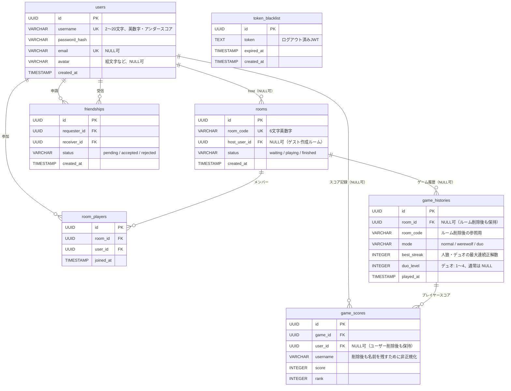

# ER図 — お絵描きの森

## テーブル概要

| テーブル | 役割 |
|---|---|
| `users` | 登録ユーザー。ゲストは DB に保存されない（JWT のみ） |
| `rooms` | ゲームルーム。ゲスト作成時は `host_user_id = NULL` |
| `room_players` | ルームへの参加登録（登録ユーザーのみ）。`(room_id, user_id)` 複合 UNIQUE |
| `token_blacklist` | ログアウト済み JWT を保存し二重利用を防ぐ |
| `game_histories` | ゲーム1回分のメタ情報。`room_id` は `SET NULL`（ルーム削除後も履歴保持） |
| `game_scores` | ゲームごとの個人スコア・順位。`user_id` は `SET NULL`（ユーザー削除後も名前は保持） |
| `friendships` | フレンド申請・承認状態。`(requester_id, receiver_id)` 複合 UNIQUE |

## 主な設計ポイント

- **ゲストユーザーは DB に存在しない** — JWT ペイロード（`isGuest: true`, `id: "guest_*"`）のみで識別
- **ゲスト作成ルームは `host_user_id = NULL`** — WS 接続時に最初に join したユーザーをホストとして扱う
- **履歴の非正規化** — `game_scores.username` を保持することで、ユーザー退会後も対戦履歴を表示可能
- **インデックス** — `token_blacklist(token)`、`game_scores(user_id)`、`game_scores(game_id)`、`friendships(requester_id)`、`friendships(receiver_id)`
